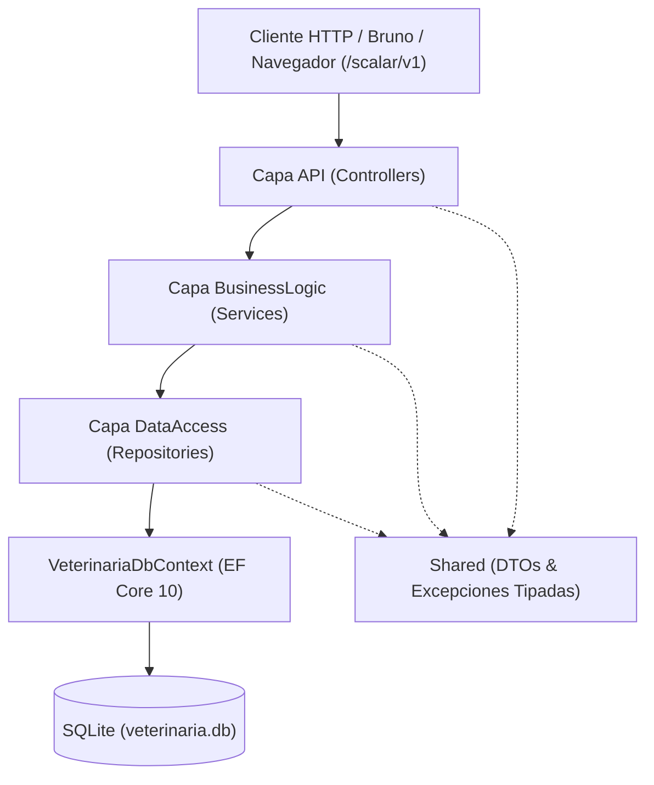

# Sistema de Gestión de Clínica Veterinaria ("Patitas") — API RESTful .NET 10

API RESTful desarrollada desde cero bajo arquitectura en capas (**N-Tier**) en **.NET 10**, implementando persistencia con **Entity Framework Core 10** y **SQLite**, documentación interactiva con **Scalar** (`/scalar/v1`), validaciones de negocio en servicios sin LINQ-to-entities, DTOs manuales desacoplados, excepciones tipadas y suite completa de pruebas unitarias (xUnit + Moq) y de integración (`WebApplicationFactory`).

---

## Enlaces de Referencia del Proyecto

* [Documento General en Google Docs](https://docs.google.com/document/d/15MJOhHVoA6IvHkjPi3N6tqI6hPOxtDK1-A6_SnPE8J8/edit?tab=t.0)
* [Diagrama de Arquitectura en Excalidraw](https://excalidraw.com/#json=LGOu8FaIBGP1mWAqq2GDl,4XjMZUIbbWtyVVLBS2Zz2Q)
* [Casos de Uso en Google Docs](https://docs.google.com/document/d/1q-qFSrRfLvsTYiwFzZFR0_yBjUnrcppa7UAtrz2hwFY/edit?usp=sharing)
* [Informe de Inconsistencias y Decisiones](file:///c:/Users/jazvi/OneDrive/Documentos/GitHub/Grupo_7_SistemaVeterinaria/INFORME-INCONSISTENCIAS-DOCUMENTACION-CASOS-DE-USO.md)

---

## 1. Arquitectura N-Tier y Flujo de Datos

El sistema implementa estrictamente el flujo unidireccional desacoplado:

$$\text{Controller (API)} \longrightarrow \text{Service (BusinessLogic)} \longrightarrow \text{Repository (DataAccess)} \longrightarrow \text{DbContext (EF Core)}$$



### Árbol de Directorios del Proyecto
```text
Grupo_7_SistemaVeterinaria/
├── API/                                 # Capa de Presentación / Controladores HTTP
│   ├── Controllers/
│   │   ├── DuenosController.cs          # Endpoints CRUD para Dueños
│   │   ├── MascotasController.cs        # Endpoints y baja lógica para Mascotas
│   │   └── AtencionesMedicasController.cs # Endpoints clínicos inmutables
│   ├── Program.cs                       # Configuración de DI, Scalar, OpenAPI y DbInitializer
│   ├── appsettings.json                 # ConnectionStrings para SQLite
│   └── API.csproj
├── BusinessLogic/                       # Capa de Lógica de Negocio Pura
│   ├── Interfaces/
│   │   ├── IDuenoService.cs
│   │   ├── IMascotaService.cs
│   │   └── IAtencionMedicaService.cs
│   ├── Services/
│   │   ├── DuenoService.cs              # Reglas RN-05, validaciones y mapeos
│   │   ├── MascotaService.cs            # Reglas RN-06, RN-07, MEJ-03 y mapeos
│   │   └── AtencionMedicaService.cs     # Reglas RN-01, RN-03, RN-04, RN-07 y fecha última visita
│   └── BusinessLogic.csproj
├── DataAccess/                          # Capa de Persistencia y Repositorios
│   ├── Context/
│   │   ├── VeterinariaDbContext.cs      # Fluent API, DeleteBehavior.Restrict, índices
│   │   └── VeterinariaDbContextFactory.cs # Migraciones CLI en tiempo de diseño
│   ├── Entities/
│   │   ├── Dueno.cs                     # Entidad Dueño con colección de mascotas
│   │   ├── Mascota.cs                   # Entidad Mascota con DueñoId y estado Activa
│   │   └── AtencionMedica.cs            # Entidad Atención Médica inmutable
│   ├── Repositories/
│   │   ├── IDuenoRepository.cs / DuenoRepository.cs
│   │   ├── IMascotaRepository.cs / MascotaRepository.cs
│   │   └── IAtencionMedicaRepository.cs / AtencionMedicaRepository.cs
│   ├── Migrations/                      # Migraciones generadas por EF Core
│   ├── Seeding/
│   │   └── DbInitializer.cs             # Creación de base y carga automática de datos semilla
│   └── DataAccess.csproj
├── Shared/                              # Capa Transversal Compartida
│   ├── DTOs/
│   │   ├── Dueno/ (Create, Update, Response)
│   │   ├── Mascota/ (Create, Update, Response)
│   │   └── AtencionMedica/ (Create, Response)
│   ├── Exceptions/                      # Excepciones tipadas (400, 404, 409)
│   └── Shared.csproj
├── tests/
│   ├── BusinessLogic.Tests/             # 22 Tests Unitarios (xUnit + Moq)
│   └── API.Tests/                       # 16 Tests de Integración (WebApplicationFactory + SQLite)
├── bruno/                               # Colección completa de requests HTTP para Bruno
├── Migrations/                          # Documentación y referencia de migraciones
├── SistemaVeterinaria.slnx              # Solución .NET 10
├── README.md                            # Documentación general y cátedra
└── AGENTS.md                            # Contexto operativo para agentes de IA
```

---

## 2. Instrucciones de Ejecución

### Prerrequisitos
* [.NET 10 SDK](https://dotnet.microsoft.com/download/dotnet/10.0) instalado (`dotnet --version` $\ge$ 10.0.x).

### 2.1. Compilar la Solución
```bash
dotnet build SistemaVeterinaria.slnx
```

### 2.2. Ejecutar la API
```bash
dotnet run --project API/API.csproj
```
Al iniciar, `DbInitializer` crea automáticamente la base de datos `veterinaria.db` (si no existe), aplica las migraciones pendientes y precarga datos iniciales de prueba (2 Dueños, 3 Mascotas [activas e inactiva] y 2 Atenciones Médicas).

### 2.3. Acceso a la Documentación Interactiva (Scalar)
Abre tu navegador en:
```text
https://localhost:7198/scalar/v1
```
*(o `http://localhost:5207/scalar/v1` en HTTP)*.

### 2.4. Ejecutar la Suite Completa de Tests (Unitarios + Integración)
```bash
dotnet test SistemaVeterinaria.slnx
```
Ejecuta las **38 pruebas automáticas** (22 unitarias con mocks + 16 de integración con `WebApplicationFactory` y SQLite en memoria).

---

## 3. Reglas de Negocio Implementadas

| Identificador | Regla de Negocio | Código HTTP | Implementación |
|---|---|:---:|---|
| **RN-01** | Inmutabilidad de las Atenciones Médicas | **409 Conflict** | Los métodos `PUT` y `DELETE` en `/api/atenciones-medicas/{id}` arrojan `AtencionInmutableException`. Las atenciones no pueden editarse ni eliminarse. |
| **RN-03 / RN-04** | Vacunación Condicionada a Aptitud Clínica | **409 Conflict** | Si se ingresa `VacunaAplicada` pero `EsAptoVacunacion` es `false`, se rechaza con `PacienteNoAptoVacunacionException`. |
| **RN-05** | Unicidad del DNI del Dueño | **409 Conflict** | No se permite registrar dueños con DNIs ya existentes (`DniDuplicadoException` e índice único en base de datos). |
| **RN-06** | Asociación Obligatoria de Mascota a Dueño | **404 Not Found** | Toda mascota requiere un `DuenoId` válido y existente (`DuenoNotFoundException`). |
| **RN-07 / MEJ-03** | Baja Lógica y Preservación Histórica | **200 OK / 409 Conflict** | La baja de una mascota es lógica (`Activa = false`). Si la mascota ya estaba inactiva, se rechaza con **409 Conflict** (`MascotaYaInactivaException`). Si estaba activa, devuelve **200 OK** con el estado `Inactiva`. |
| **RN-07 (Clínica)** | Restricción de Atención en Inactivas | **409 Conflict** | Una mascota inactiva no puede recibir nuevas consultas ni atenciones médicas (`MascotaInactivaException`). |
| **DeleteBehavior.Restrict** | Protección de Eliminación en Cascada | **409 Conflict** | No se puede eliminar un dueño que tenga mascotas registradas (`DuenoConMascotasException`). |
| **Fecha Última Visita** | Actualización Automática | **200 OK** | Al registrar una atención médica exitosa, se actualiza automáticamente la fecha de última visita de la mascota. |

---

## 4. Catálogo de Endpoints RESTful y Ejemplos

### 4.1. Módulo Dueños (`/api/duenos`)

#### `POST /api/duenos` — Registrar Dueño
* **Request:**
```json
{
  "nombre": "Carlos",
  "apellido": "González",
  "dni": "34567890",
  "telefono": "11-4567-8901",
  "email": "carlos.gonzalez@example.com",
  "direccion": "Av. Corrientes 1234, CABA"
}
```
* **Response (201 Created):**
```json
{
  "id": "a1b2c3d4-e5f6-7a8b-9c0d-1e2f3a4b5c6d",
  "nombre": "Carlos",
  "apellido": "González",
  "dni": "34567890",
  "telefono": "11-4567-8901",
  "email": "carlos.gonzalez@example.com",
  "direccion": "Av. Corrientes 1234, CABA",
  "fechaRegistro": "2026-10-09T00:00:00Z",
  "cantidadMascotas": 0
}
```
* **Error (409 Conflict):** Si el DNI ya existe:
```json
{
  "message": "Ya existe un dueño registrado con el DNI '34567890'."
}
```

---

### 4.2. Módulo Mascotas (`/api/mascotas`)

#### `POST /api/mascotas` — Registrar Mascota
* **Request:**
```json
{
  "duenoId": "a1b2c3d4-e5f6-7a8b-9c0d-1e2f3a4b5c6d",
  "nombre": "Milo",
  "especie": "Perro",
  "raza": "Golden Retriever",
  "sexo": "Macho",
  "fechaNacimiento": "2023-04-15T00:00:00Z",
  "peso": 28.5,
  "observaciones": "Paciente dócil."
}
```
* **Response (201 Created):**
```json
{
  "id": "b2c3d4e5-f6a7-8b9c-0d1e-2f3a4b5c6d7e",
  "duenoId": "a1b2c3d4-e5f6-7a8b-9c0d-1e2f3a4b5c6d",
  "nombreDueno": "Carlos González",
  "nombre": "Milo",
  "especie": "Perro",
  "raza": "Golden Retriever",
  "sexo": "Macho",
  "fechaNacimiento": "2023-04-15T00:00:00Z",
  "peso": 28.5,
  "activa": true,
  "fechaUltimaVisita": null,
  "observaciones": "Paciente dócil."
}
```

#### `PATCH /api/mascotas/{id}/desactivar` — Baja Lógica (MEJ-03)
* **Response (200 OK — Mascota Activa dada de baja):**
```json
{
  "id": "b2c3d4e5-f6a7-8b9c-0d1e-2f3a4b5c6d7e",
  "nombre": "Milo",
  "activa": false,
  "observaciones": "Paciente dócil."
}
```
* **Response (409 Conflict — Mascota ya se encontraba inactiva):**
```json
{
  "message": "La mascota con identificador 'b2c3d4e5-f6a7-8b9c-0d1e-2f3a4b5c6d7e' ya se encuentra inactiva."
}
```

---

### 4.3. Módulo Atenciones Médicas (`/api/atenciones-medicas`)

#### `POST /api/atenciones-medicas` — Registrar Atención Médica
* **Request:**
```json
{
  "mascotaId": "b2c3d4e5-f6a7-8b9c-0d1e-2f3a4b5c6d7e",
  "motivoConsulta": "Control anual y vacunación antirrábica",
  "diagnostico": "Paciente clínicamente sano",
  "tratamiento": "Aplicación de vacuna antirrábica",
  "pesoRegistrado": 29.0,
  "esAptoVacunacion": true,
  "vacunaAplicada": "Antirrábica Canina",
  "observaciones": "Próximo control en 12 meses."
}
```
* **Response (201 Created):**
```json
{
  "id": "c3d4e5f6-a7b8-9c0d-1e2f-3a4b5c6d7e8f",
  "mascotaId": "b2c3d4e5-f6a7-8b9c-0d1e-2f3a4b5c6d7e",
  "nombreMascota": "Milo",
  "fecha": "2026-10-09T03:00:00Z",
  "motivoConsulta": "Control anual y vacunación antirrábica",
  "diagnostico": "Paciente clínicamente sano",
  "tratamiento": "Aplicación de vacuna antirrábica",
  "pesoRegistrado": 29.0,
  "esAptoVacunacion": true,
  "vacunaAplicada": "Antirrábica Canina",
  "observaciones": "Próximo control en 12 meses."
}
```
* **Error (409 Conflict — Paciente No Apto para Vacuna):**
```json
{
  "message": "No se puede registrar una vacuna para la mascota '...' porque la evaluación clínica determinó que no es apta para vacunación."
}
```
* **Error (409 Conflict — Mascota Inactiva):**
```json
{
  "message": "La mascota con identificador '...' está inactiva y no puede recibir nuevas atenciones médicas ni turnos."
}
```

#### `PUT /api/atenciones-medicas/{id}` o `DELETE /api/atenciones-medicas/{id}` — Inmutabilidad (RN-01)
* **Response (409 Conflict):**
```json
{
  "message": "La atención médica con identificador 'c3d4e5f6-a7b8-9c0d-1e2f-3a4b5c6d7e8f' es inmutable y no puede ser modificada ni eliminada."
}
```

---

## 5. Colección de Bruno (`bruno/`)

La carpeta `bruno/` contiene la colección completa lista para importar en [Bruno HTTP Client](https://www.usebruno.com/):
* `bruno/duenos/`: Pruebas de listar, buscar, alta (201), conflicto DNI (409), actualizar y restricción de borrado (409).
* `bruno/mascotas/`: Pruebas de listado completo y filtrado por activas, búsqueda por dueño, alta (201), baja lógica (200 OK) y conflicto de ya inactiva (409 Conflict).
* `bruno/atenciones-medicas/`: Pruebas de consulta, alta exitosa (201), conflicto por vacuna no apta (409), conflicto por mascota inactiva (409), y prueba de inmutabilidad en PUT y DELETE (409).